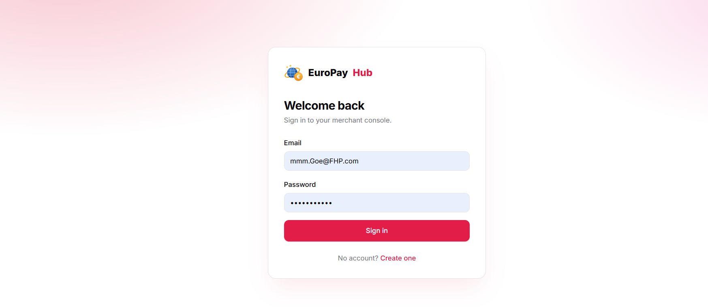
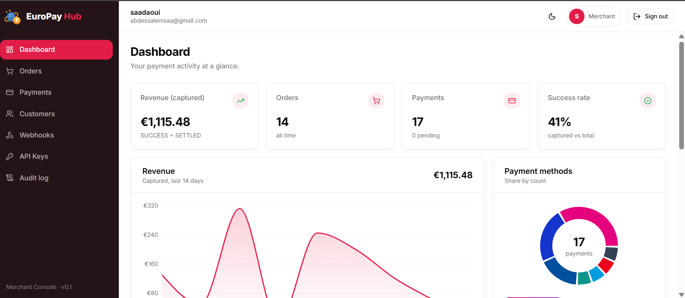
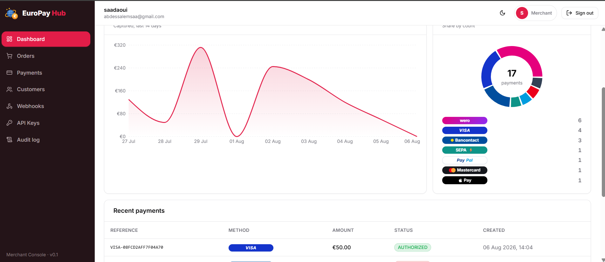
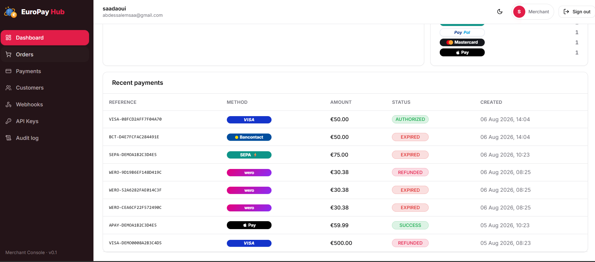
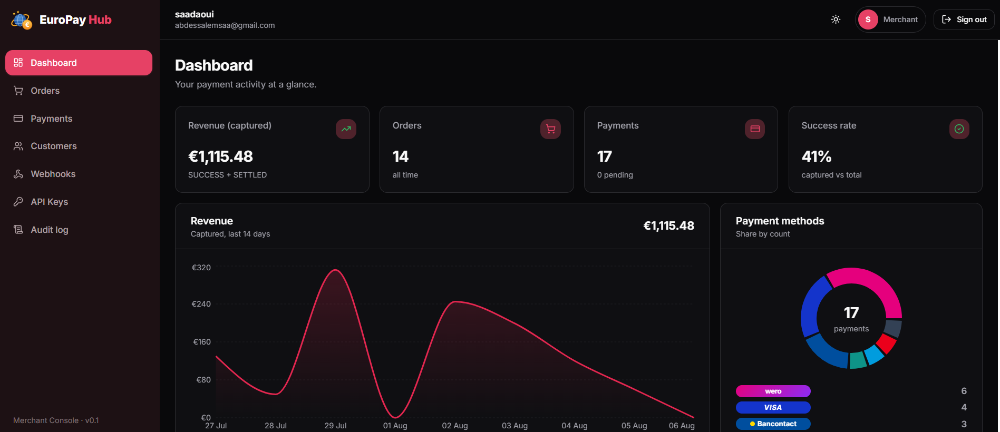
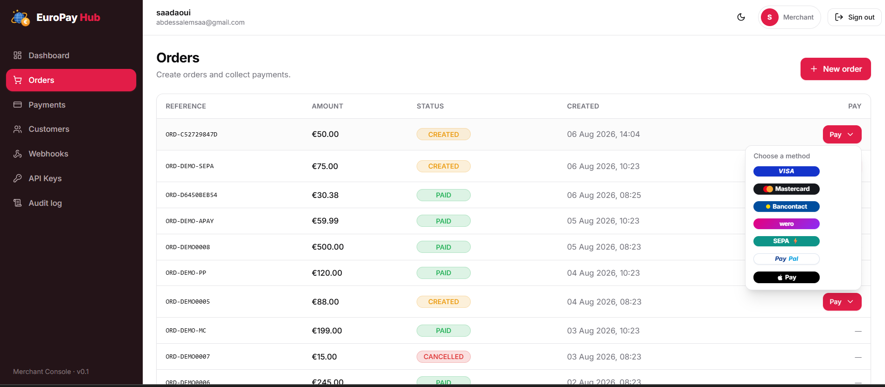
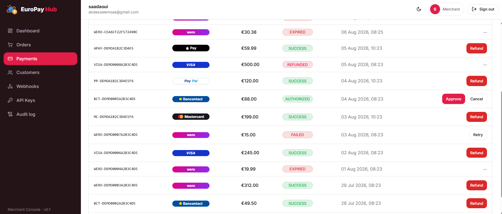
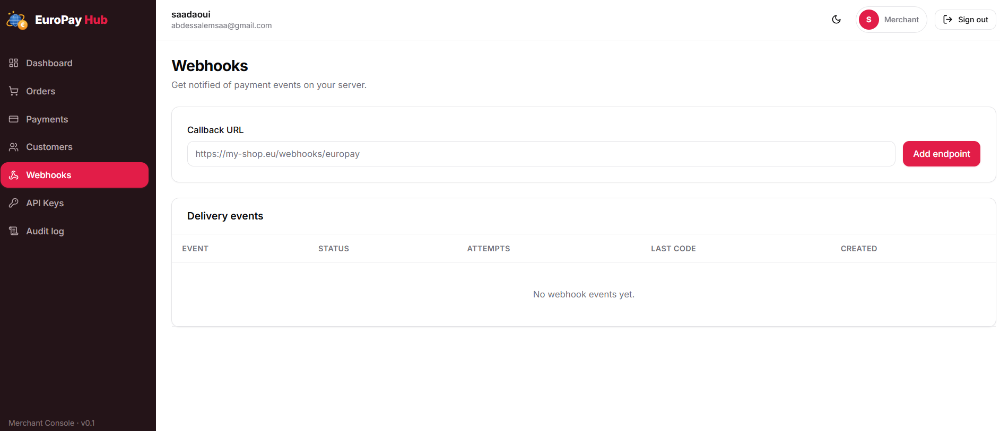
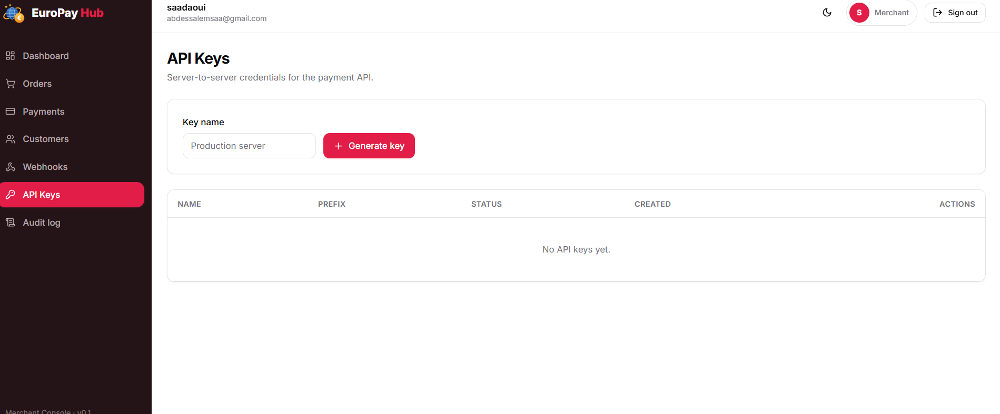
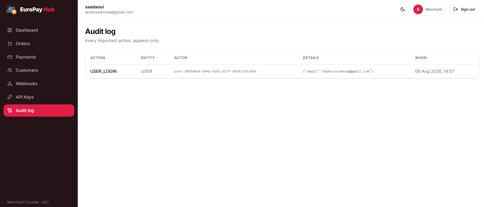

<div align="center">

# 💶 EuroPay Hub

**A modern European Merchant Payment Platform** — inspired by Worldline and the European Payments Initiative.

*Accept 7 payment methods — Visa · Mastercard · Bancontact · Wero · SEPA Instant · PayPal · Apple Pay — through a single, clean API.*

<br/>

**Status**

[](https://github.com/abdessalems/europay-hub/actions)


**Backend**


**Frontend**


</div>

> **Portfolio project.** Built to demonstrate enterprise architecture, clean code, payment-domain knowledge, and Functional-Analysis skills — the kind of platform a backend team at a European payment company would ship. It is **not** a CRUD app.

---

## ✨ Features

- **Single API, multiple payment methods** — Wero, Bancontact, Visa (mock providers via the Strategy pattern; Mastercard / SEPA Instant / PayPal / Apple Pay are drop-in extensions).
- **Full payment lifecycle** — an explicit state machine (`CREATED → PENDING → AUTHORIZED → SUCCESS → SETTLED`, plus `FAILED / EXPIRED / CANCELLED / REFUNDED`) that makes illegal transitions impossible.
- **Idempotent payments** — duplicate requests are collapsed with an `Idempotency-Key`, exactly like real PSPs.
- **Webhooks done right** — merchant callbacks with HMAC signatures, a transactional outbox, and 3× retry with backoff.
- **Two auth models** — JWT for the dashboard, API keys (hashed at rest) for server-to-server calls.
- **Audit everything** — every important action is recorded.
- **Money that doesn't lie** — a `Money` value object in minor units (cents); never a `double`.

## 🏛 Architecture

Modular monolith built with **Clean Architecture + DDD**, packaged **feature-first, then layer-first**. Dependencies point strictly inward and the rule is **enforced in CI by ArchUnit**.

```
Presentation ─▶ Application ─▶ Domain ◀─ Infrastructure
   (REST)         (use cases)   (core)     (JPA, mock PSPs, webhooks)
```

Bounded contexts: `iam` · `merchant` · `customer` · `order` · **`payment`** (core) · `webhook` · `audit`.
Each is a candidate for extraction into a microservice — dependencies only cross through published interfaces (ports) and domain events.

## 🧰 Tech Stack

| Area | Technology |
|---|---|
| Language / Runtime | Java 21 (records, sealed types, pattern matching) |
| Framework | Spring Boot 3.4, Spring Web, Spring Data JPA, Spring Security *(Phase 1)* |
| Database | PostgreSQL 16 + Flyway migrations |
| API docs | OpenAPI 3 / Swagger UI (springdoc) |
| Mapping | MapStruct · DTOs everywhere (entities never exposed) |
| Testing | JUnit 5, Mockito, AssertJ, **Testcontainers**, **ArchUnit** |
| Build / CI | Maven (wrapper included) · GitHub Actions · Docker Compose |

## 📁 Project Structure

```
europay-hub/
├── docs/                     # Functional-Analyst deliverables (BRD, specs, diagrams…)
├── docker/                   # docker-compose.yml, Dockerfile
├── src/main/java/com/europay/hub/
│   ├── shared/               # Shared kernel: Money, ApiResponse, DomainEvent…
│   ├── config/ · security/   # Cross-cutting configuration & error handling
│   └── features/             # Bounded contexts, each: domain/application/infrastructure/presentation
├── src/main/resources/db/migration/   # Flyway V1…Vn
└── src/test/java/…/architecture/       # ArchUnit rules (enforce the layering)
```

## 🚀 How to Run

### Prerequisites
- JDK 21 (ensure `JAVA_HOME` points to a **21** JDK)
- Docker (for PostgreSQL and integration tests)

### 1. Start the database
```bash
docker compose -f docker/docker-compose.yml up -d
```

### 2. Run the app
```bash
./mvnw spring-boot:run
```

### 3. Or run everything in containers
```bash
docker compose -f docker/docker-compose.yml --profile full up --build
```

> **Ports.** The database is published on host **5433** (→ container 5432) to avoid clashing with a locally installed PostgreSQL. The app listens on **8080**; override with `SERVER_PORT=8081 ./mvnw spring-boot:run` if 8080 is taken.

### Run the dashboard (frontend)
```bash
cd frontend
npm install
npm run dev            # http://localhost:5173  (API base via VITE_API_URL, default :8081)
```
The backend enables CORS for `http://localhost:5173`. See screenshots below.

### Verify
- Service info … `GET http://localhost:8080/api/system/info`
- Health … `GET http://localhost:8080/actuator/health`
- Swagger UI … `http://localhost:8080/swagger-ui.html`

### Test
```bash
./mvnw test          # unit + architecture tests (no Docker needed)
./mvnw verify        # + Testcontainers integration tests (requires a running Docker daemon)
```

## 📖 API Documentation

Interactive OpenAPI docs are served at `/swagger-ui.html` (with an **Authorize** button for JWT). Endpoints:

| Method | Path | Description | Status |
|---|---|---|---|
| POST | `/api/auth/register` | Register a merchant + owner user | ✅ |
| POST | `/api/auth/login` | Log in, receive a JWT | ✅ |
| GET | `/api/merchants/me` | My merchant profile | ✅ |
| POST | `/api/merchants/me/api-keys` | Create an API key (secret shown once) | ✅ |
| GET | `/api/merchants/me/api-keys` | List my API keys (no secrets) | ✅ |
| DELETE | `/api/merchants/me/api-keys/{id}` | Revoke an API key | ✅ |
| POST | `/api/orders` | Create an order (customer auto-created) | ✅ |
| GET | `/api/orders/{id}` · `/api/orders` | View / list (paginated) orders | ✅ |
| POST | `/api/orders/{id}/cancel` | Cancel an order | ✅ |
| GET | `/api/customers` · `/api/customers/{id}` | List / view customers | ✅ |
| GET | `/api/customers/{id}/orders` | Customer order history | ✅ |
| POST | `/api/payments` | Create a payment (Idempotency-Key aware; JWT or API key) | ✅ |
| GET | `/api/payments/{id}` · `/api/payments` | Payment status / list (paginated) | ✅ |
| POST | `/api/payments/{id}/approve` | Approve → SUCCESS (marks order paid) | ✅ |
| POST | `/api/payments/{id}/refund` | Refund a successful payment | ✅ |
| POST | `/api/payments/{id}/cancel` · `/retry` | Cancel / retry a payment | ✅ |
| PUT | `/api/webhooks/endpoint` | Configure webhook (URL + secret) | ✅ |
| GET | `/api/webhooks/endpoint` · `/events` | View endpoint / list delivery events | ✅ |

| GET | `/api/dashboard` | Server-computed merchant metrics | ✅ |
| GET | `/api/audit-logs` | Append-only audit log (paged) | ✅ |

## 🗺 Roadmap

| Phase | Theme | Status |
|---|---|---|
| 0 | Skeleton, shared kernel, CI, ArchUnit, FA docs foundation | ✅ |
| 1 | IAM & Merchant (JWT, roles, hashed API keys) | ✅ |
| 2 | Orders & Customers (pagination, order lifecycle) | ✅ |
| 3 | Payment core (state machine, mock providers, idempotency, API-key auth) | ✅ |
| 4 | Payment lifecycle (approve, refund, cancel, retry, expiry job) | ✅ |
| 5 | Webhooks (outbox, HMAC signing, 3× retry with backoff, delivery logs) | ✅ |
| 6 | Audit log + server-computed dashboard metrics | ✅ |
| 7 | Hardening & full documentation | ✅ |

## 🔮 Future Improvements

Redis (idempotency cache), RabbitMQ (async event bus), settlement/reconciliation batches, multi-currency, 3-D Secure simulation, rate limiting, and partial refunds.

## 📸 Screenshots

The **EuroPay Dashboard** (`/frontend`) — React + Vite + Tailwind, consuming the live API.

### Login & Dashboard
| Login | Dashboard |
|---|---|
|  |  |

Server-computed KPIs (revenue, orders, payments, success rate), a 14-day revenue chart, and a payment-methods donut:




### Dark mode


### Orders & Payments
| Orders (create + pay) | Payments (approve / refund / cancel / retry) |
|---|---|
|  |  |

All seven methods render as branded chips: **Visa, Mastercard, Bancontact, Wero, SEPA Instant, PayPal, Apple Pay**.

### Webhooks, API Keys & Audit log
| Webhooks | API Keys | Audit log |
|---|---|---|
|  |  |  |

## ⚖️ Disclaimer & Trademarks

EuroPay Hub is an **independent, educational portfolio project**. It is **not affiliated with, endorsed by, or connected to** Worldline, the European Payments Initiative, Wero, Bancontact, Visa, Mastercard, PayPal, Apple Pay, or any payment provider or bank.

All payment integrations are **mock implementations** — no real payments are processed and no real provider APIs are called. Product and company names, and all payment-method names and marks (Wero, Bancontact, Visa, Mastercard, PayPal, Apple Pay, SEPA, …), are **trademarks of their respective owners** and are used here **only nominatively**, to identify the methods this demo simulates. No third-party logo files are bundled; the in-app method marks are original renderings.

## 📄 License

The **source code of this project** is released under the **MIT License** — see [LICENSE](LICENSE). The MIT license applies to this project's own code only; it grants no rights in any third-party trademark, brand, or name referenced above.
