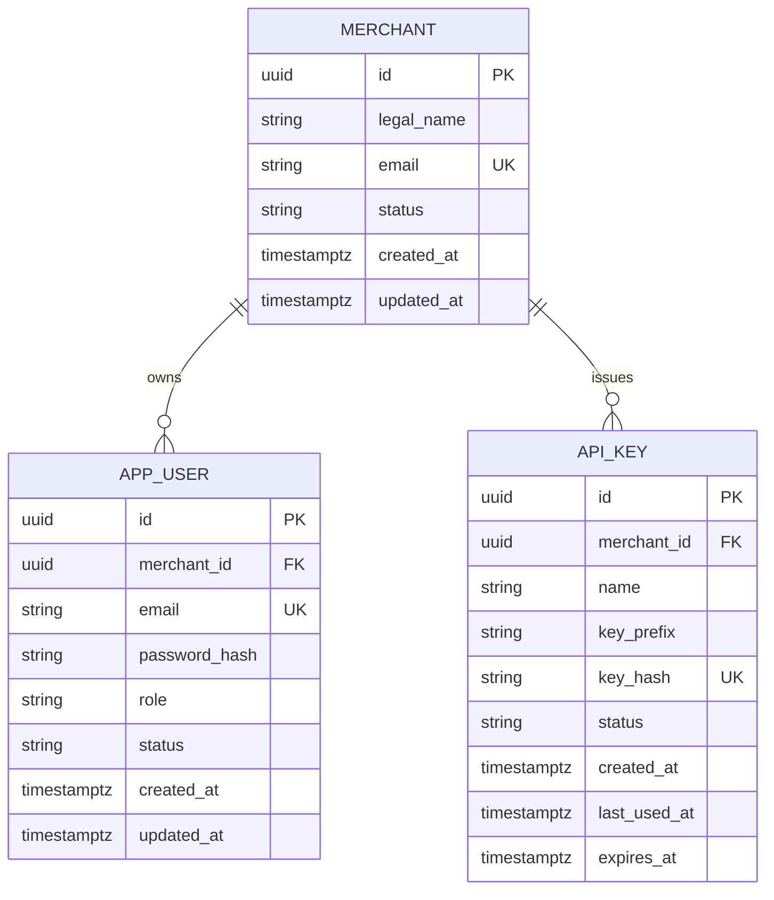
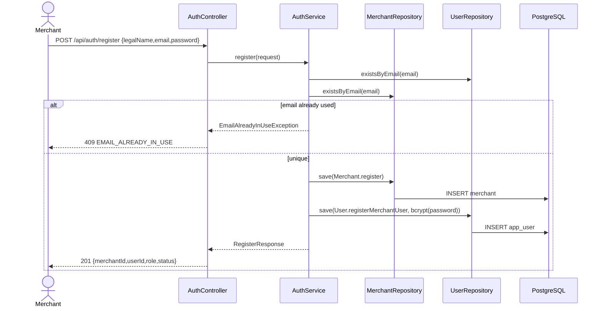
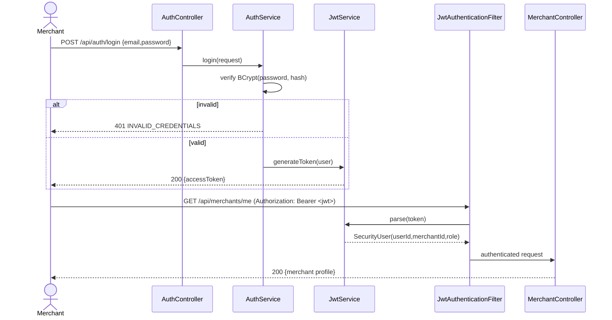

# Phase 1 Diagrams — IAM & Merchant

## ER Diagram (Phase 1 tables)

```mermaid
erDiagram
    MERCHANT ||--o{ APP_USER : "owns"
    MERCHANT ||--o{ API_KEY : "issues"

    MERCHANT {
        uuid id PK
        string legal_name
        string email UK
        string status
        timestamptz created_at
        timestamptz updated_at
    }
    APP_USER {
        uuid id PK
        uuid merchant_id FK
        string email UK
        string password_hash
        string role
        string status
        timestamptz created_at
        timestamptz updated_at
    }
    API_KEY {
        uuid id PK
        uuid merchant_id FK
        string name
        string key_prefix
        string key_hash UK
        string status
        timestamptz created_at
        timestamptz last_used_at
        timestamptz expires_at
    }
```

## Sequence — Registration (UC-001)

```mermaid
sequenceDiagram
    actor M as Merchant
    participant C as AuthController
    participant S as AuthService
    participant MR as MerchantRepository
    participant UR as UserRepository
    participant DB as PostgreSQL

    M->>C: POST /api/auth/register {legalName,email,password}
    C->>S: register(request)
    S->>UR: existsByEmail(email)
    S->>MR: existsByEmail(email)
    alt email already used
        S-->>C: EmailAlreadyInUseException
        C-->>M: 409 EMAIL_ALREADY_IN_USE
    else unique
        S->>MR: save(Merchant.register)
        MR->>DB: INSERT merchant
        S->>UR: save(User.registerMerchantUser, bcrypt(password))
        UR->>DB: INSERT app_user
        S-->>C: RegisterResponse
        C-->>M: 201 {merchantId,userId,role,status}
    end
```

## Sequence — Login + authenticated call (UC-002)

```mermaid
sequenceDiagram
    actor M as Merchant
    participant AC as AuthController
    participant AS as AuthService
    participant J as JwtService
    participant F as JwtAuthenticationFilter
    participant MC as MerchantController

    M->>AC: POST /api/auth/login {email,password}
    AC->>AS: login(request)
    AS->>AS: verify BCrypt(password, hash)
    alt invalid
        AS-->>M: 401 INVALID_CREDENTIALS
    else valid
        AS->>J: generateToken(user)
        J-->>M: 200 {accessToken}
    end

    M->>F: GET /api/merchants/me  (Authorization: Bearer <jwt>)
    F->>J: parse(token)
    J-->>F: SecurityUser(userId,merchantId,role)
    F->>MC: authenticated request
    MC-->>M: 200 {merchant profile}
```
