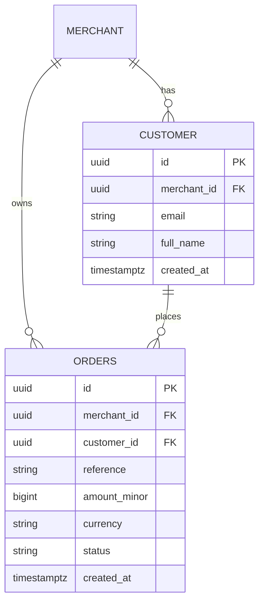
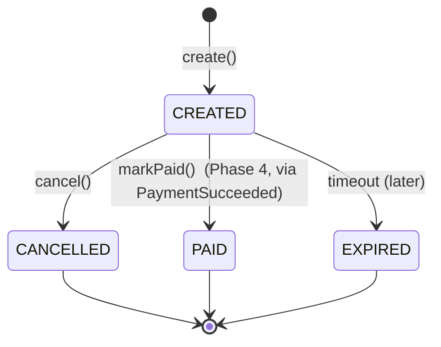
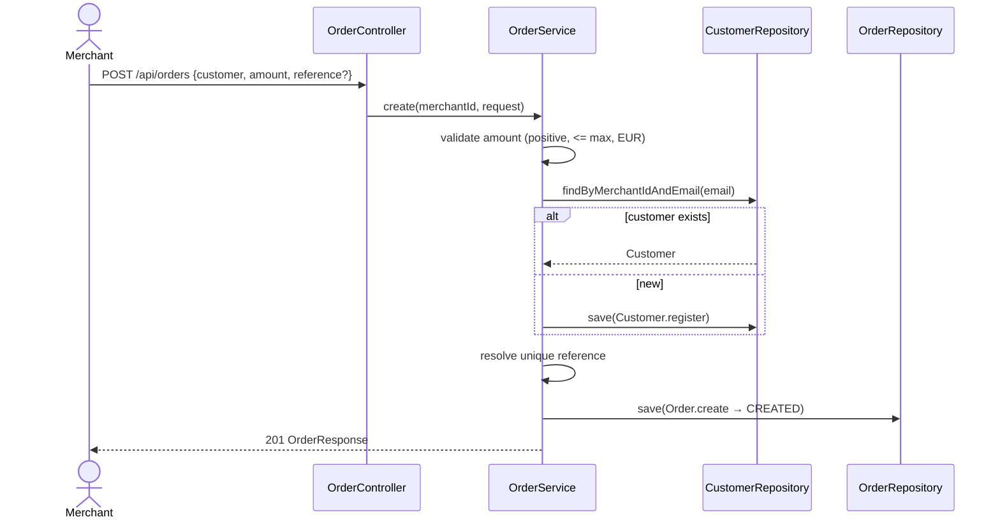

# Phase 2 Diagrams — Orders & Customers

## ER Diagram (Phase 2 tables)

Unique constraints: `customer(merchant_id, email)`, `orders(merchant_id, reference)`.

## Order lifecycle (Phase 2 scope)

## Sequence — Create order (UC-003)

