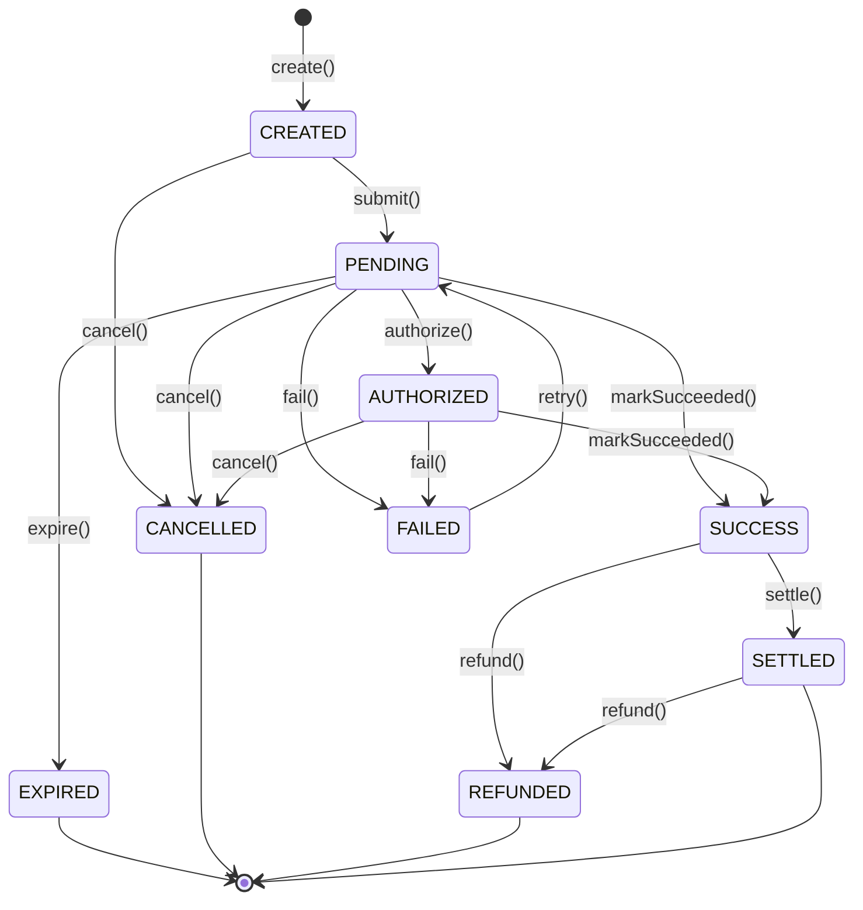
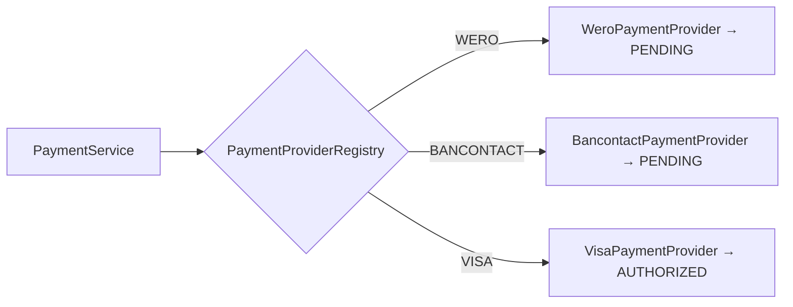
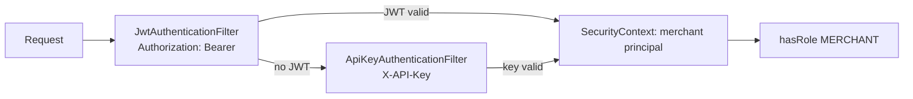

# Phase 3 Diagrams — Payment Core

## Payment state machine (full)


Phase 3 exercises `create → submit` (and Visa `→ authorize`). The remaining transitions (capture, refund, expire, retry, settle) are wired and unit-tested, and are driven by Phase 4.

## Provider strategy


Adding Mastercard/SEPA/PayPal = one new `PaymentProvider` bean; the factory registers it automatically (Open/Closed).

## Sequence — Create payment (UC-004)

```mermaid
sequenceDiagram
    actor C as Merchant / Server
    participant PC as PaymentController
    participant PS as PaymentService
    participant I as IdempotencyStore
    participant OR as OrderRepository
    participant PR as PaymentProvider
    participant DB as PaymentRepository

    C->>PC: POST /api/payments {orderId, method} [Idempotency-Key]
    PC->>PS: create(merchantId, request, key)
    opt key present
        PS->>I: find(merchant, key)
        alt same request already processed
            I-->>PS: record
            PS-->>C: 201 original payment (replay)
        end
    end
    PS->>OR: load order (owned, CREATED)
    PS->>PS: Payment.create(...)
    PS->>PR: submit(payment)   %% Strategy by method
    PR-->>PS: ProviderResult(ref, outcome)
    PS->>PS: payment.submit(ref); apply outcome
    PS->>DB: save(payment)
    opt key present
        PS->>I: save(record)
    end
    PS-->>C: 201 PaymentResponse
```

## Authentication (two paths)


