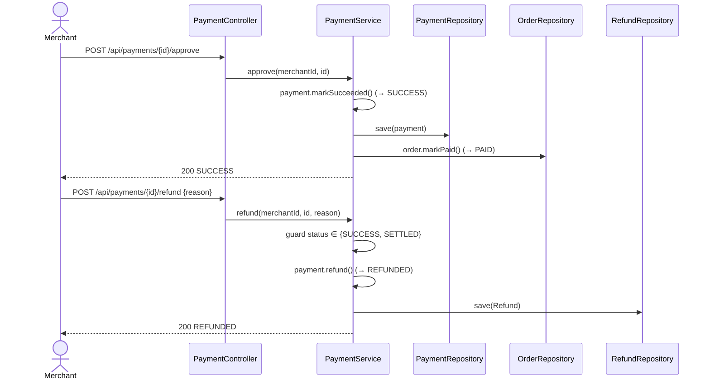
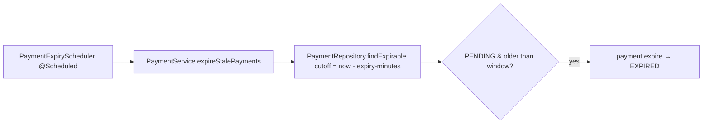

# Phase 4 Diagrams — Payment Lifecycle

The full payment state machine is in [Phase 3](phase3-payment.md#payment-state-machine-full). Phase 4 drives the remaining transitions (approve, refund, cancel, retry, expire) and cascades success to the order.

## Sequence — Approve → order paid → refund

## Expiry job

