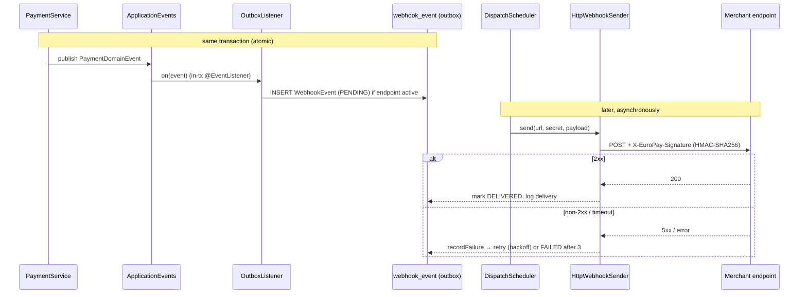
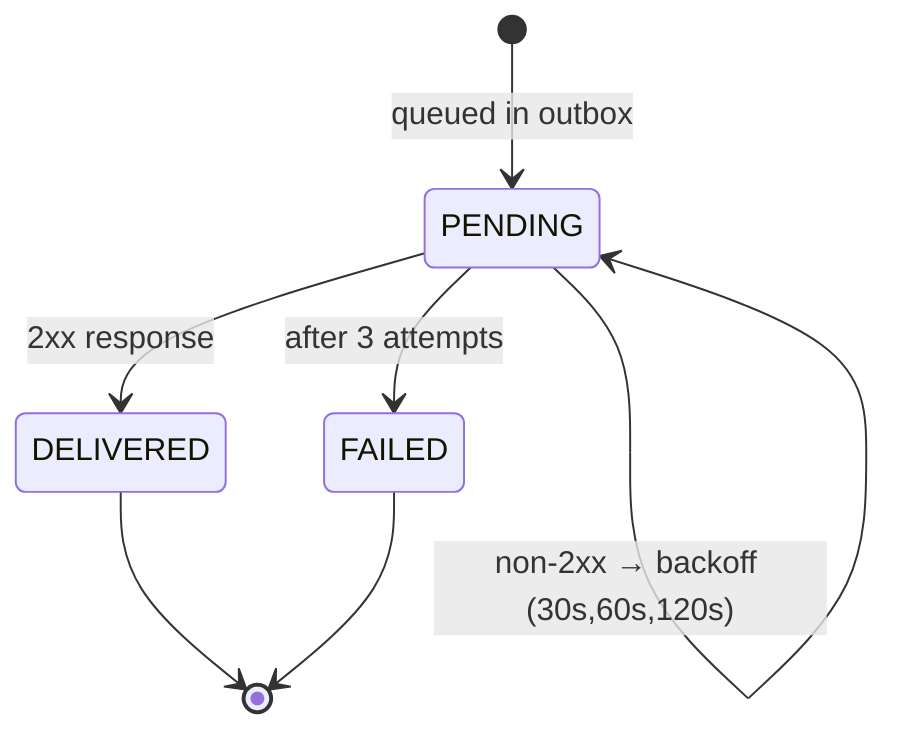

# Phase 5 Diagrams — Webhooks

## Outbox + dispatch (sequence)

```mermaid
sequenceDiagram
    participant PS as PaymentService
    participant EV as ApplicationEvents
    participant OL as OutboxListener
    participant DB as webhook_event (outbox)
    participant SC as DispatchScheduler
    participant SND as HttpWebhookSender
    participant M as Merchant endpoint

    Note over PS,DB: same transaction (atomic)
    PS->>EV: publish PaymentDomainEvent
    EV->>OL: on(event)  (in-tx @EventListener)
    OL->>DB: INSERT WebhookEvent (PENDING) if endpoint active
    Note over SC,M: later, asynchronously
    SC->>SND: send(url, secret, payload)
    SND->>M: POST + X-EuroPay-Signature (HMAC-SHA256)
    alt 2xx
        M-->>SND: 200
        SND-->>DB: mark DELIVERED, log delivery
    else non-2xx / timeout
        M-->>SND: 5xx / error
        SND-->>DB: recordFailure → retry (backoff) or FAILED after 3
    end
```

## Delivery state

```mermaid
stateDiagram-v2
    [*] --> PENDING : queued in outbox
    PENDING --> DELIVERED : 2xx response
    PENDING --> PENDING : non-2xx → backoff (30s,60s,120s)
    PENDING --> FAILED : after 3 attempts
    DELIVERED --> [*]
    FAILED --> [*]
```

Backoff: attempt 1 → +30s, attempt 2 → +60s, then give up on attempt 3 (`max_attempts = 3`).
