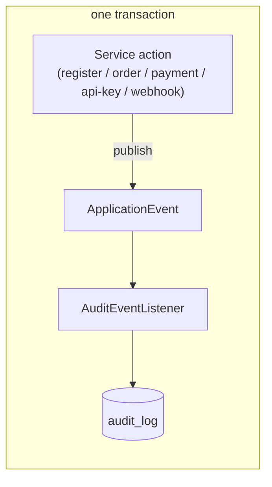
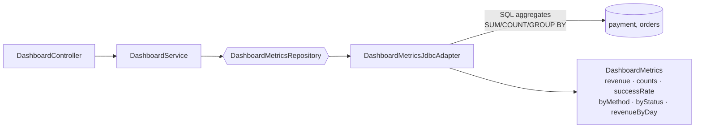

# Phase 6 Diagrams — Audit & Dashboard

## Audit (event-driven, in-transaction)

Payment lifecycle is audited from `PaymentDomainEvent`; everything else publishes a shared `AuditEvent`. Both listeners run synchronously inside the action's transaction, so the action and its audit row commit together.

## Dashboard read model

The dashboard never loads whole tables — all KPIs and chart series are computed with SQL aggregates scoped to the merchant.
